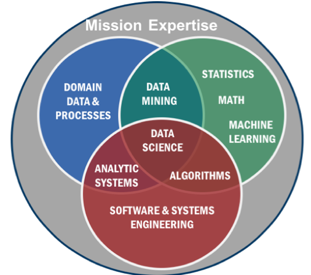
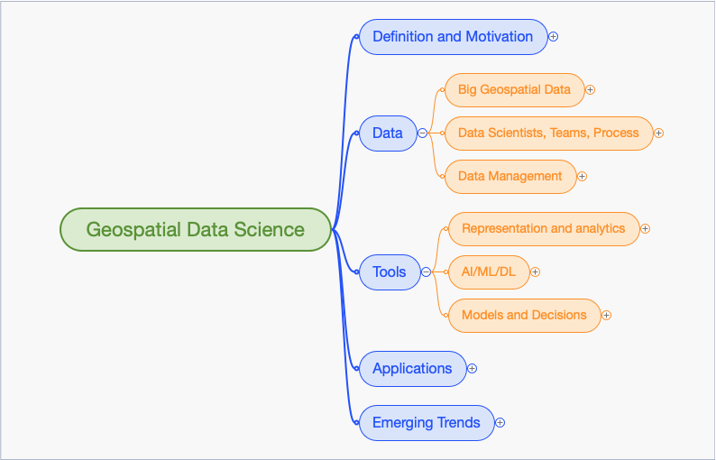

== Geospatial Data Science Overview
//write text in as many clauses as necessary. Use one document or many, your choice!

Geospatial Data Science is “The art and craft of people leveraging technology to create value out of data.”This definition was provided by Andy Brooks, NGA Chief Data Scientist – Location Powers Data Science Summit.

Data Science in the context of Big Data systems includes: 1) mathematical and computer science foundations in statistics and machine learning; along with 2) software and systems engineering methods to handle large data volumes and innovative query and analytics techniques; and, in some extended definitions, may include 3) domain data and processes.

.Data Science - from NIST Big Data interoperability Framework, Volume 1 – Definitions

The emergence of Data Science concepts and motivation can be traced to Jim Grey’s concepts captured in The Fourth Paradigm: Data-Intensive Scientific Discovery, by Tony Hey, Stewart Tansley, and Kristin Tolle.  This book surveys opportunities and challenges for data-intensive science to prepare for the data deluge of a “sensors everywhere” data infrastructure supporting a fourth paradigm of scientific research based on “Data Exploration”.  Alternatively, the methods of data exploration can be seen as emerging from statistics and a fifty-year history of Data Science [David Donoho].  Success has many parents.

Considering Data Science in the contenxt of Geospatial Information is producing tremendous results.  Geospatial information is experiencing the data explosion of mobile devices, remote sensing and the Internet of Things perhaps more than other fields as all of these data types include location, spatial and temporal information.  A summary of the topics discussed in the Location Powers Data Science Summit is shown in the figure:
: value

.Geospatial Data Science

This White Paper is organized in these sections:'

* Data Topics
** Big Geospatial Data (Clause 3)
** Data Scientists, Teams, Process (Clause 4)
** Data Management (Clause 5)
* Tools
** Representation and analytics (Clause 6)
** AI and Machine Learning (Clause 7)
** Models and Decisions (Clause 8)
* Data Science Applications (Clause 9)
* Emerging Trends (Clause 10)

The Emerging Trends are: Edge Computing, Heterogeneous Computing, and Data Ethics.
