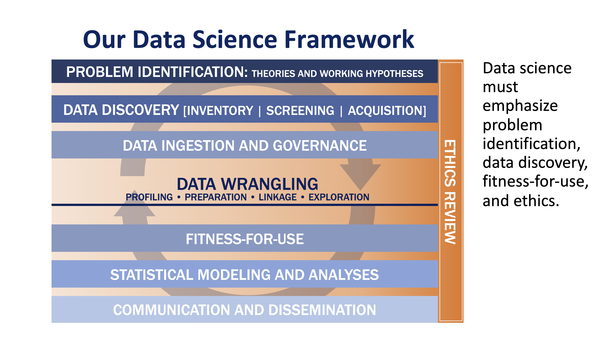
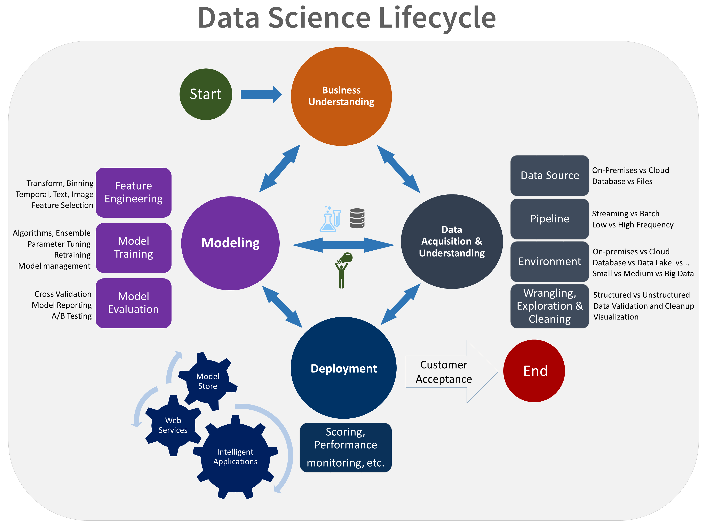

== Data Scientists, Teams, Process

This section addresses three topics related to people and process for data science.

** Data Scientists and multi-disciplinary teams
** The role of tools: human augmentation
** Data Science Process
** Training and Institutionalization

=== Data Scientists and Multi-Disciplinary Teams

To be effective, Data Scientists must work with multi-disciplinary teams.  The teams need to include individuals expert in the domain of study or application.  Data Scientists cannot be effective by applying generic data science tools without tuning, interpretation, and guidance from a team that provides broad understanding of the domain area.

Several quotes are representative of the LP_DS discussions:

** “I teach my data scientists how to work on interdisciplinary teams” –Jeanne Holm,  UCLA
** “I want them to be respectful and understanding of the scope that storytellers bring, what geospatial experts bring, what policymakers bring”
** “Going in as a data-scientist-with-the-answers was often counterproductive” -  Regan Smyth, NatureServe
** “Running models but not understanding the drivers and whether data science can help can be misleading” - discussion group

The role of geospatial experts in the team was discussed as represented by these quotes:

** “Geospatial analysts are domain experts; data scientists tend to sit more horizontal” – Devaki Raj, CrowdAI
** “You don't see data scientists necessarily learning geospatial technology but you expect you spatial technologists to learn data science” - discussion group
** “Data science tools become more flexible for people that have domain expertise” - discussion group.

=== The Role of Tools: Human Augmentation

Without tools, data science would not be possible.  But tools and the results they produce without human interpretation are not useful, or worse, they can be misleading.  Tools that augment human intelligence are the most effective.

Several quotes are representative of these LP_DS discussions:

** “We can't tensorflow our way out of this problem” – Andy Brooks
** “The r-squared is really high, but its garbage” – discussion group   
** “Opportunity for commercial vendors to implement for it to become routine.  User interface need not change with new stuff going on under the hood” - Marc Armstrong
** “SWAT team of nerds” - Megan Furman

=== Data Science Process

Several approaches to Data Science process definition or methodology were presented and discussed at LP_DS.

Stephanie Shipp, Univ of Virginia, presented their Data Science Framework.  The UVA framework emphasizes working with the project sponsors to identify the problem as defined by the sponsors.  Beginning with those discussions sharpens the focus; along with looking at the literature and talking to experts.  Then the data discovery aspect of the framework is preconditioned by the problem identification.  You don't just start with the data that's readily accessible.  Then the process is like other data science frameworks where the data wrangling, profiling the data to assess your data quality.  This is iterative work as data wrangling takes about 80% of your time. Reducing that load would leave more time for statistical modeling and analyses.

.UVA Data Science Framework

Andy Brooks, NGA Chief Scientist, used the https://dschool.stanford.edu/resources/this-is-design-work[Stanford D-School] process to explain his teams approach to the data science process.  The numbers in the figure is the approach that Andy used to explain their data science methodology.

.NGA Data Science approach based on Stanfor d-school
image::figures/FIG04.02_NGA_data_sci_process.png[400,400]

1. Experiences: Discussion of how do you do this today, what is the role of data in this experience, what works doesn't work;  to get that ground level  visceral learned experience from the people who need the results of data science.
2. Data: then start talking about the data. Where is this data coming from; how are you using it; is it "big data"; is it small data living in spreadsheets, etc. To get that sense of what that work is and how they do it.  We're purposely not looking at technologies or products.
3. Technologies: Discuss what technology is used now; what do they think technology is; how is it used. Not about products, but more about the fundamental technology underneath  and what's their literacy with using different forms of technology.
4. Products: Move to how does the data, technologies and products all roll together in an experience of what they're trying to do.  First understanding fundamental things like the data is not really that good; or the underlying technology doesn't work; or the policy isn't enabling them. That's why products come along later in the process.
5.  Systems: Further along come discussions on how to understand the system; to scale what you're trying to do; who are those people that you need to get to those teams you need to work with across the organization.
6. Implications: then consider the implications, e.g., of speeding up a workflow and making it that much faster, because there is that thing where it's like well it used to take ten people two weeks to do one thing that would spit something out and now it takes like one person clicking on a script and they can do it in like ten minutes well like there's a lot of implications for that.

The https://docs.microsoft.com/en-us/azure/machine-learning/team-data-science-process/overview[Azure Data Science Lifecycle] was not presented in the LP_DS Summit, but as it is consistent with the discussions at the LP_DS Summit is presented here.  It is an iterative data science methodology that focuses on team collaboration and learning; with an initial business understanding prior to data acquisition and modeling. It is a generic process  that can be implemented with a variety of tools.

.Azure Data Science Lifecycle

=== Training and Institutionalization

To support institutionalization of geospatial data science, data scientists need training and education and organizations need to persist the best practices and standards that emerge from successful projects.  Several

* https://gsi.cigi.illinois.edu/[The Geospatial Software Institute concept study] as presented at LP_DS by Anand Padmanabhan, University of Illinois, was a US National Science Foundation sponsored study to conceptualize GSI as a long-term hub of excellence in geospatial software to serve diverse research and education communities. The CyberGIS center at UIUC led the conceptualization project that include key aspects of geospatial data science. The CyberGIS Summer school provides education and training for indviduals learning geospatial data science.
* https://dsf.lacity.org/[The Data Science Foundation] as presented at LP_DS by Jeanne Holm, City of Los Angeles, is a partnership between The City of LA with local colleges and universities; as a resource in data science and data-driven decision making for City Government.
* https://www.nga.mil/Careers/Pages/Data-Corps.aspx[The NGA Data Corps] is a targeted initiative to support Data Scientists in solving complex, high-stakes data problems; teaching data skills to colleagues; and education to ensure keeping pace with the latest tools, techniques and technology.
* https://www.fedscoop.com/interview-michael-conlin-talent-challenge/[The Defense Digital Service] looks to both attract and create talent over time to meld tricky domain expertise with data science training.  Megan Furman, DDS, spoke of her team as a "Swat Team of Nerds."
* https://www.airc.aist.go.jp/en/intro/[AIST Artificial Intelligence Research Center (AIRC)] as presented at LP_DS by Satoshi Sekiguchi, offers a “venue” for open innovation that connects the proprietary data and expertise in machine learning, simulation technology, natural language processing, and development of computational architecture for AI. AIRC is a public organization that coordinates AI technology by promoting the sharing of data that cannot be made public by businesses and universities.
* https://www.opengeospatial.org/[The Open Geospatial Consortium] provides the processes for communities to advance geospatial data science.  The OGC Geospatial AI Domain Working Group and the OGC Big Data Domain Working Group are chartered to foster discussion, to identify community best practices and as needed initiate standardization relevant to geospatial data science.

==== Recommendations

This preceding sections of this Clause motivate several recommendations.

** Identify and promote Community Practices and Best Practices for Geospatial Data Science.
** Promote the development of institutes that capture current practices, research advancements and training practitioners in geospatial data science.
