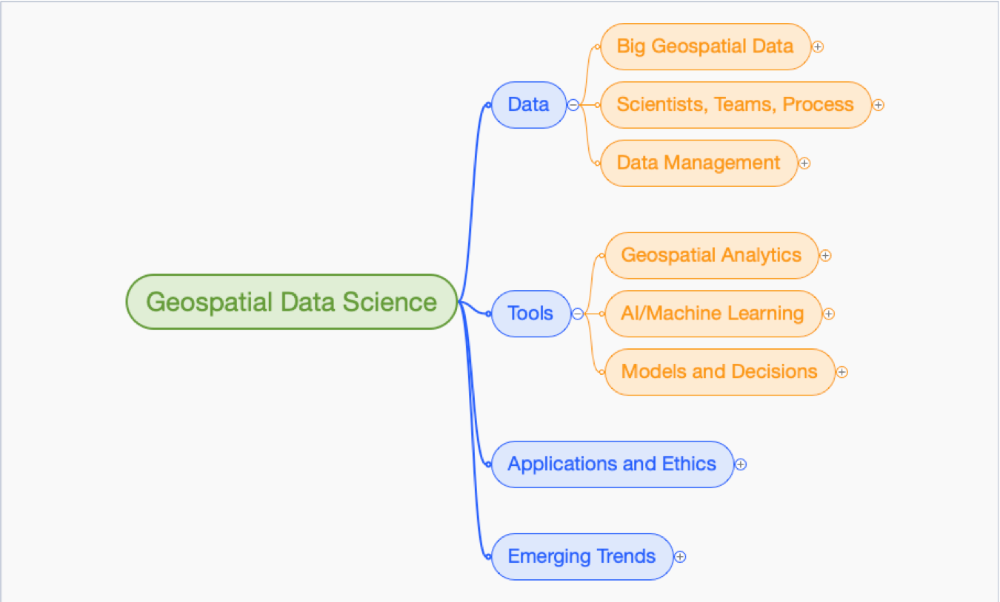

== Overview of White Paper
//write text in as many clauses as necessary. Use one document or many, your choice!

Geospatial Data Science has been identified as an important development by the Open Geospatial Consortium (OGC).  The OGC Technology Forecasting activity began focusing on data science as an outcome of the development of the Big Geospatial Data topic area.  Both Big Data and Data Science have been topics in recent Location Powers Summits.

The Location Powers: Data Science Summit (LP_DS) organized by OGC was held on November 13 and 14, at Google, Mountain View, CA.  This OGC Tech Note was developed based on the Summit.  This Geospatial Data Science Tech Note captures the content of the Summit and provide a basis for further action in OGC and beyond.

The Location Powers Summit series brings together industry, research and government experts from across the globe into an interactive discussion that assess the current situation and produces recommendations for future technology innovations and standards development.   The Location Powers Summits are key to the technology innovation promoted by the Open Geospatial Consortium (OGC).
The Location Powers: Data Science Summit convened experts on data science, machine learning, artificial intelligence, cloud computing, remote sensing and GIS to provide a technology basis.  Participation by leaders in social sciences, business development and government policy will lead to recommendations that have meaningful outcomes from the geospatial data science developments.

The LP_DS Summit considered the explosive availability of data about nearly every aspect of human activity along with revolutionary advances in computing technologies is transforming geospatial data science.    The shift from data-scarce to data-rich environment comes from mobile devices, remote sensing and the Internet of Things. Nearly all of this data has components of location and time. Innovations in cloud computing and big data provides methods to perform data analytics at exceedingly large scale and speed. The development of intelligent systems using knowledge models and their impact on our insights and understanding was the focus of the LP_DS.

A summary of the topics discussed in the LP_DS is shown in the figure:

.Geospatial Data Science

This White Paper is organized in these sections:'

* Data Topics
** Big Geospatial Data (Clause 3)
** Data Scientists, Teams, Process (Clause 4)
** Data Management (Clause 5)
* Tools
** Geospatial Representations and Analytics (Clause 6)
** AI and Machine Learning (Clause 7)
** Models and Decisions (Clause 8)
* Data Science Applications and Ethics (Clause 9)
* Emerging Trends (Clause 10)

The Emerging Trends are: Edge Computing and Heterogeneous Computing

The Annex provides information about the summit including the agenda.
