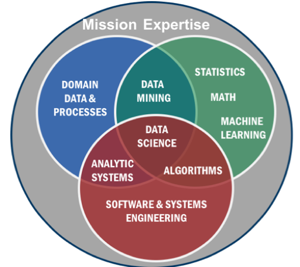

== Overview of Geospatial Data Science

....
Geospatial Data Science is “The art and craft of people leveraging technology
to create value out of data using location and time.”
....

This definition was developed and repeated in several presentations and discussion sessions of the Location Powers Data Science Summit (LP_DS).

To set the context for LP_DS, a definition for Data Science in the context of Big Data systems coming from NIST was considered.  https://bigdatawg.nist.gov/_uploadfiles/NIST.SP.1500-1r1.pdf[NIST Big Data Interoperability Framework: Volume 1, Definitions] defines Data Science as the extraction of useful knowledge directly from data through a process of discovery, or of hypothesis formulation and hypothesis testing. The NIST document goes onto identify Data Science Sub-disciplines as 1) Mathematical and computer science foundations in statistics and machine learning; along with 2) Software and systems engineering methods to handle large data volumes and innovative query and analytics techniques; and, in some extended definitions, may include 3) domain data and processes.

.Data Science from NIST Big Data interoperability Framework

Considering Data Science in the context of Geospatial Information is producing tremendous results.  Geospatial information is experiencing the data explosion of mobile devices, remote sensing and the Internet of Things perhaps more than other fields as all of these data types include location, spatial and temporal information.

The Location Powers: Data Science Summit expanded beyond the topics listed above leading to this outline of key topics in Geospatial Data Science: Data, Tools, Applications, and Trends.

* Data:  It is obvious but important to state that Data is a core topic of data science.  The availability of increasing availability of data triggered new possible analysis.  Geospatial Data which has always been big data provides opportunities for analytics in data science. Therefore the opening discussion of data is about Big Geospatial Data (Clause 3). For data science to be effective, data scientists needs to work in multi-disciplinary teams with an agile process.  These topics are addressed in Data Scientists, Teams, Process (Clause 4). Managing big data requires addressing data policy along with the ecosystems and platforms to manage the data.  Cloud-Native data management is providing nimble and novel methods to work with big data. These topics are addressed in Data Management (Clause 5)

* Tools:  Working with Big Data requires appropriate tools.  As geospatial has always been big data, many of the geospatial analysis methods were data science before the term was introduced.  Methods long familiar to the geospatial community along with extensions to those methods are addressed in the clause on Representation and analytics (Clause 6). The third wave of Artificial Intelligence has been lead by machine learning based such as convolutional neural networks.  The application of machine learning to big geo data in particular imagery is addressed in AI and Machine Learning (Clause 7).  Knowledge based data science depends upon models that are predictive of some portion of the geospatial world. Spatial decision support is supported by knowledge based models.  These topics are address in the last tools clause on Models and Decisions (Clause 8).

* Applications of Data Science to geospatial data is already producing results.  The Location Powers Data Science Summit discussed nearly a dozen application areas which are discussed in  Applications (Clause 9)

* Trends that look to be further advancing geospatial data science include Computing at the Edge, Heterogenous Computing and Data Ethics.  Each of these are addressed in Emerging Trends  (Clause 10).
