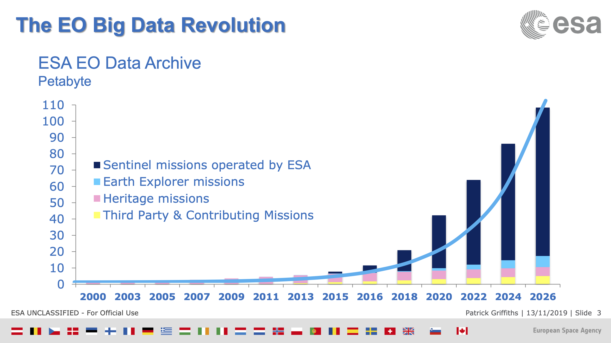
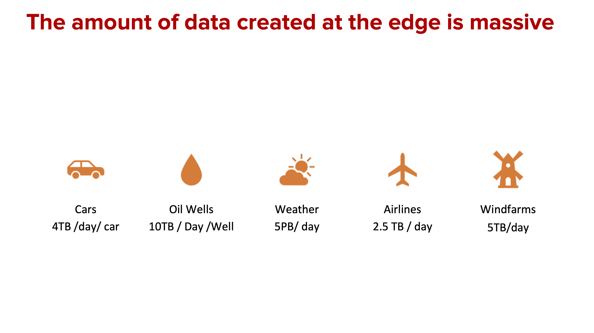
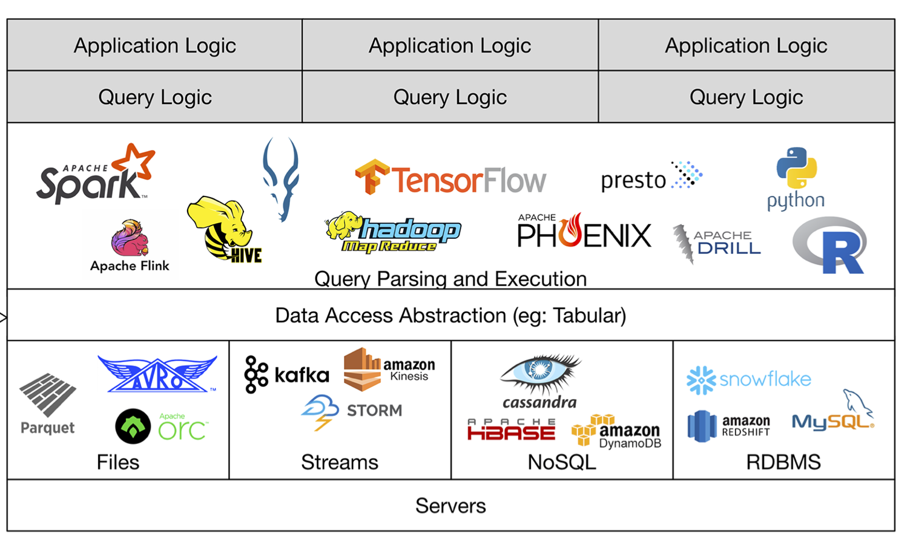
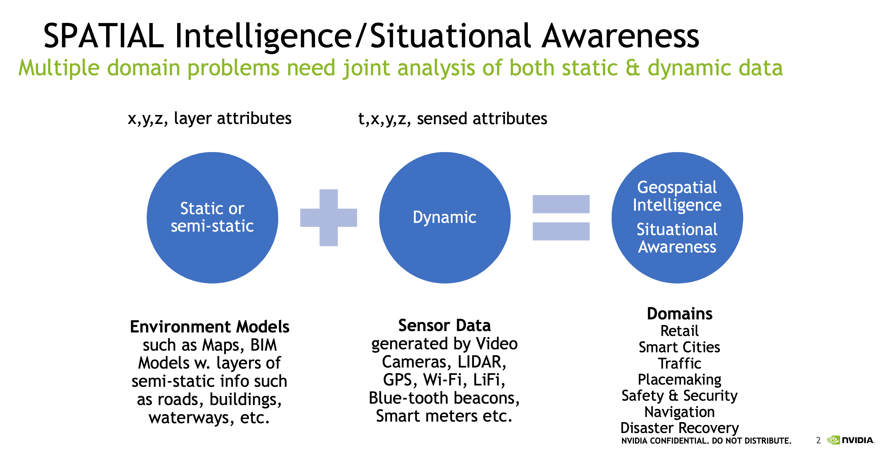
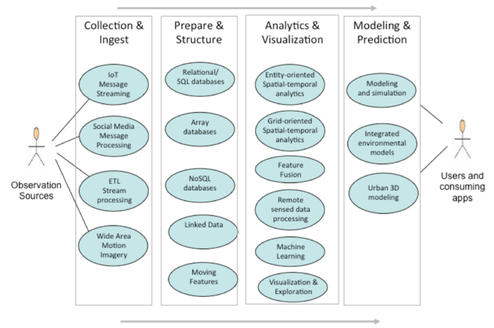

== Data: Big Geospatial Data

This Clause addresses three topics related to big data for data science.

** Big Data with Location
** Big Data Software Stack
** Big Geo Data Use Cases

=== Big Data with Location

The emergence of Data Science concepts and motivation can be traced to Jim Grey’s concepts that were captured in The Fourth Paradigm: Data-Intensive Scientific Discovery, by Tony Hey, Stewart Tansley, and Kristin Tolle.  This book surveys opportunities and challenges for data-intensive science to prepare for the data deluge of a “sensors everywhere” data infrastructure supporting a fourth paradigm of scientific research based on “Data Exploration”.  A recurring theme in Location Powers: Data Science summit was that of "telling stories with data".  Using stories to explore and understand the data from a domain results in insights not previously available.  Data Science can be described as the exploration of big data about a domain.

Geospatial data has always been big data was a theme of two Location Powers: Big Data summits and the resulting https://docs.opengeospatial.org/wp/16-131r2/16-131r2.html[Big Geospatial Data – an OGC White Paper]. The Big Geo Data white paper had these main themes:

** Geospatial data is increasing in volume and variety;
** New Big Data computing techniques are being applied to geospatial data;
** Geospatial Big Data techniques benefit many applications; and
** Open standards are needed for interoperability, efficiency, innovation and cost effectiveness.

The growth of geospatial highlighted in the Big Geo Data White Paper continues and is increasing.  Patrick Griffiths, ESA, highlighted this trend during LP_DS.  The ESA archives alone will be over 100 Petabytes by 2026.

.The EO Big Data Revolution

Marc Armstrong, Univ of Iowa, at LP_DS described future satellite constellations that are being planned by different companies including Amazon and SpaceX. SpaceX is planning to deploy 12,000 satellites for communications, military, and scientific purposes.  The revisit rate for viewing locations will increase dramatically. BlackSky is proposing 40 to 70 times each day. In addition to the static imagery there's a lot of streaming video that's going to be provided as well.

The Big Geo Data revolution is not only driven by remote sensing from satellites.  Philippe Cases, Topio Networks, provided estimates to LP_DS on the magnitude of the data deluge coming from edge devices.  All of this Edge Data has components of location and time that can be exploited in data science.

.Big Data Revolution from the Edge

It is important to emphasis that this growing data has components of location and time.  During LP_DS, Ed Parsons, Google, emphasized the ubiquity of location by introducing the definition of "ambient location."

....
Ambient Location
adjective
denoting or relating to a knowledge of a location that is continuously accessible.
"A smartphone provides the user with an ambient location service."
....

=== Big Data Software Stack

The growth of Big Stack drove the development of a fundamentally different software computing platform.  The Birth of the Big Data Stack in late 1990s and early 2000s provided extreme flexibility and scalability in distributed batch applications for data at ever increasing volumes.  https://www.usenix.org/system/files/login/articles/login_winter18_08_khurana.pdf[The Modern Data Architecture: The Deconstructed Database] provides a good summary of these developments and includes this figure.

.The Birth of the Big Data Stack

At the core of the big data stack was Apache Hadoop, which started in 2006 as a spin-off from Apache Nutch, a web crawler that stemmed from Apache Lucene, the famous open source search engine. The inspiration for this project came from the Google File System and a distributed processing framework called MapReduce. These two components combined the extreme flexibility and scalability necessary to develop distributed batch applications in a simple way. 

The use of Big Data Stack software for geospatial applications has been the theme of the Geospatial Track at the annual Apache Conference. The Apache Software Foundation has been a focal point for development of the pages in the big data stack. These big data software packages have been extended with geospatial functionality and presented in the ApacheCon geospatial track.  These items were presented in the https://www.ogc.org/otherevents/apachecon-2019-geospatial-track[ApacheCon 2019 Geospatial Track]: GeoSpark built on Apache Spark, Apache Science Data Analytics Platform, GeoMesa on top of Accumulo, HBase, Cassandra, Geospatial Indexing and Search at Scale with Apache Lucene, Realtime Geospatial Analytics with GPUs, RAPIDS, and Apache Arrow

In later clauses of this white paper we will see how the Big Data Stack is important to data management (Clause 5), geospatial analytics (Clause 6), and Machine Learning (Clause 7).

=== Big Geo Data Use Cases

Milind Naphade, NVIDIA Metropolis, picked up on the LP_DS theme of big geo data discussing spatial intelligence.  Exploiting this growth in data will require both cloud computing but Computing at the Edge as well (See Clause 10 for more on this emerging trend). Both the volume and the rate at which these data is coming requires pushing the processing closer to source at the edge. This will impact many vertical applications in terms of getting situational awareness.

.Situational Awareness based on Location

The https://docs.opengeospatial.org/wp/16-131r2/16-131r2.html[Big Geospatial Data – an OGC White Paper] presented a set of use cases that apply across the application domains. The Use Cases were organized into four groups as shown in the figure. The use cases to the right of the figure provide a motivation for Geospatial Data Science.

.Big Geo Data Use Cases for Data Science

==== Recommendations

This Clause motivates several recommendations.

** Plan for the continued grouwth of Big Geo Data
** Continue to work with broad Big Data Stack to make geospatial data a routine data type for the broadest communities and to make the Big Data Stack extensible to complex analysis based on spatial temporal analytics.
** Identify common geospatial Data Science Use cases that can be reused across applications
