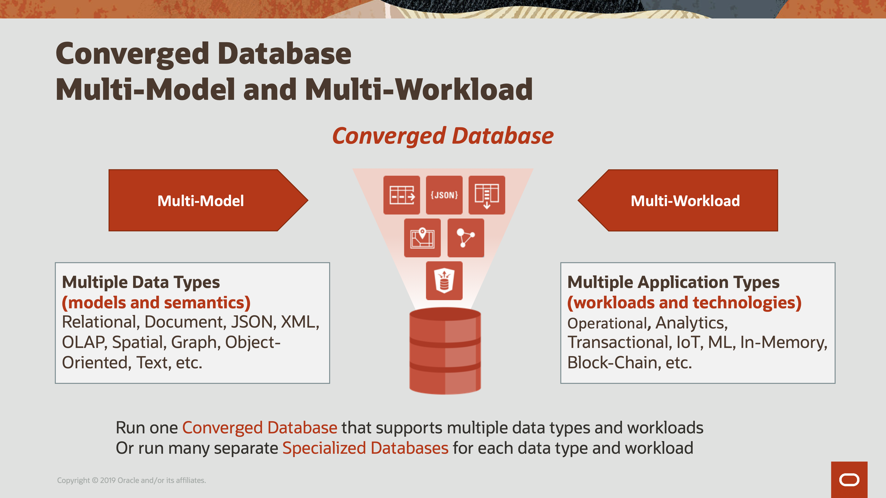
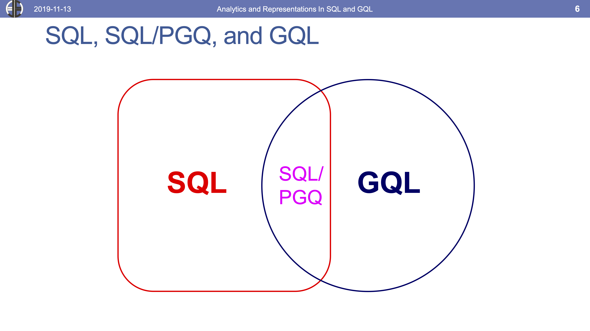
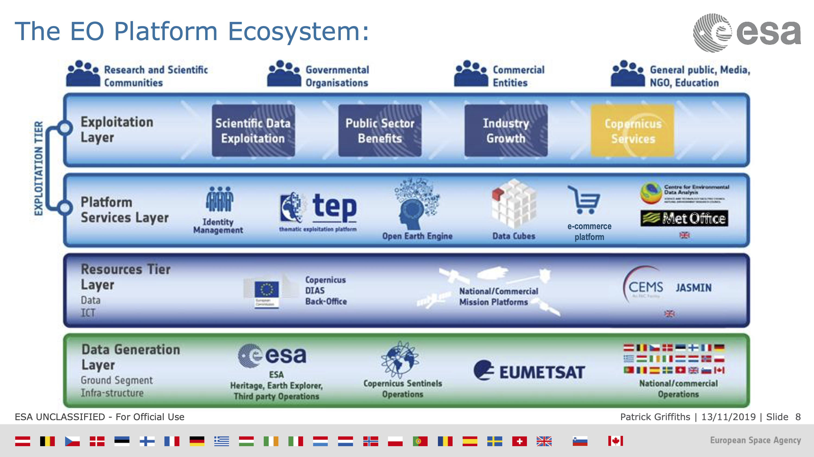

== Data: Data Management

This Clause addresses topics related to people and process for data science.

** Data Management Policies

** Data Base Management Systems

** Cloud Native Data and Processing

** Geospatial Data Platforms and Ecosystems

** Recommendations

=== Data Management Policies

Accessibility to data involves many issues.  This section addresses the policies associated with making data available.

Several LP_DS discussions described the desirable situation where a data is accessible with known license, provenance and quality.  There are trends to make research datasets more readily available due to requirements coming from the sponsors of the research, e.g., US National Science Foundation.  Some of the discussions suggested that 3rd party organizations take the responsibility of a clearing house to make the data well documented and accessible without relying on the research team.   Others suggested that tools like GitHub and Jupyter Notebooks are making easy for researchers to publish their results.

Quotes from LP_DS regarding data agreements:

** "How can we go beyond the current state which is a big lake of data where you just have to look for it by yourself and figuring out yourself if the data is good or not?"

** "We need to address our data sharing agreements they often get in the way and hold up our work.   There's ways to overcome that that are not terribly hard. "

** "A role for entities that behave as data authorities in the future that server as centralized sources of data; they ensure that the data and the metadata is good quality and follows the standards and they clarify data sharing agreements."

** "Need better methods to make data communicate the range of data agreements where not everything is fully open or is open under certain conditions."

** "Would be helpful to extend use schema.org and others to include the data sharing agreement aspect, so for example, you could search for images that have certain copyright or open new standards."

Quotes from LP_DS regarding dataset hosting and clearinghouses:

** "In  cases where researchers received federal grant money and they are supposed to publish data openly,  but the challenge that you briefly mention is the incentive and resources that they don't have so they do the research everything ready results are published in a paper at the end."

** "The PI and the student or postdoc don't have the incentives to put it in a public repo or documented or don't have the technical resources. Usually they're more of a scientist than an engineer. I think one thing that would be helpful is policies and resources in those grants to help grantees to share their data openly beyond just a policy but on the implementation side."

** "I think the private sector needs to step up and make data accessibility and data quality an important issue and be able to be part of this research community in terms of providing good high quality data for very important issues."

** "For federal data, data.gov serves the purpose of a clearinghouse."

** "We are at Google so let's give a shout out to Google dataset search. You can now specifically search for datasets."

Quotes from LP_DS regarding actions to take to further increase and ensure availability of open data and make recommendations to them:

** "While open data has soared in terms of quality and quantity but making it more standardized if possible as it comes in all different formats and also needs to come with more metadata as well. It's much better than it was but it still has a way to go in terms of being standardized; another place for standards."

** "Big open archives of observation data are readily available but what's lacking is the availability of in-situ data, reference data and training data. Need to motivate research groups to reprocess their reference data and bring it into the standardized format."

** "When we started building Data.Gov, I had to convince folks at 175 federal agencies that it was okay to publish messy data; it was okay if your data was incomplete; it was okay to publish the data the best way you could."

** "We can't ignore the political issues around keeping data that may be inconvenient for one administration or another. Keeping data open over time because people are running businesses and they are running in analyses and data journalists are linking to this data all the time and they need to have real-time accurate data that is standardized to the extent possible but accessible over time."

Other issues about data sharing policies included discussion of data privacy and data ethics.  This will be take up on Clause 10 on the emerging trend of Data Ethics.

Access to training data sets for machine learning is discussed in Clause 7.

While not explicitly mentioned, the FAIR Principles (making data Findable, Accessible, Interoperable, and Reusable) capture much of the discussion about data management policies during LP_DS.  A recent issue of the https://www.mitpressjournals.org/toc/dint/current[Data Intelligence journal] addressed the history, progress and possible futures around the FAIR Principles.  OGC lists the FAIR Principles in its mission statement.

Working with the https://www.rd-alliance.org/group/research-data-repository-interoperability-wg/outcomes/research-data-repository-0[Research Data Alliance] to develop data management policy topics should be considered.

=== Data Management Strategies and Query Languages

Strategies for data base management continue to change.  Data strategies for modern applications require many different data types and workloads.  Data types include relational, document, spatial, graph/linked data.  Workloads include transactions, analytics, machine learning, streaming, etc.  Each data type and workload requires different data strategies.  Jayant Sharma, Oracle, described two approaches to data strategy: single-purpose "best-of-breed" for each data type and workload; or a converged database to address all data types and workloads.  A converged database does not mean centralized database.  The benefits of a converged database is that it supports mixing of workloads, data types and algorithms; and it prevents data fragmentation; and enables powerful synergies across features, e.g., SQL and transactions across any data type.

.Coverage Database Data Strategy

The LP_DS included discussion of SQL and GQL by Keith Hare, Convener of ISO/IEC JTC1 SC32 WG 3, that manages standards for data languages.  The SQL standards include support for geospatial data with spatial queries, temporal queries, and very recently multi-dimensional arrays.  Currently SC32 WG3 is developing standards to address property graphs both extensions to SQL for property graph queries as well as a declarative property graph query language titled GQL. OGC is contributing to the spatial capabilities of GQL.

.Property Graph Query Languages and SQL

=== Cloud Native Data and Processing

As described in Clause 3, an innovative stack of software and interfaces was developed to address big data.  The Big Data Platform was grew with the development of Cloud Computing.  Several discussions in LP_DS discussed advantages of a "cloud-native" strategy for handling big geo data.  Mark Korver, Amazon AWS, described the growth in size and functionality provided by cloud computing.  AWS hosts over two trillion objects.  Object stores offer not only data storage but the bigger advantage is having the data and computing in close proximity.  Satoshi Sekiguchi, AIST, spoke about the key features of the cloud native strategy for their AI Bridging Cloud Infrastructure (ABCI) system and how it supports the sharing, distribution and operation of AI and Machine Learning on large data stores.

To support Cloud-Native strategy several specification activities were discussed as needing standardization activities: Spatio-Temporal Asset Catalog (STAC), Cloud-optimized GeoTIFF, HDF for the cloud, ZARR and X Array, and OGC APIs.

http://www.ogcapi.org/[OGC APIs] providing access to cloud hosted data and analytics are under development. The first standard released in 2019 was OGC API Features - Core.  STAC is a consistent with OGC API Features as both were developed, in part, in several sprints where the two specs were worked concurrently.  For coverages, including raster and other data structures, OGC API - Coverages is under development.

Lauren Bennett, Esri, concluded one of the discussions on this topic with:  "I guess from from my perspective it's about making it really easy for people to go between these different platforms; to bring together these diverse sets of data; and a diverse set of methods, models, algorithms; that are coming from all over the place. The standards allow integration  that's crucial as people we need people not to be stuck in one place."

=== Geospatial Data Platforms and Ecosystems

Multiple organizations are defining platforms for geospatial data science on top of cloud computing and data stores. ESA's EO Platform Ecosystem and several other approaches have been discussed in the https://www.ogc.org/projects/groups/eoexplatform[OGC EO Exploitation Platform Domain Working Group].  Emergence of community practices to be used in common is an objective of the working group.

Patrick Griffiths, ESA, presented an EO Platform Ecosystem which depicts the earth observation platform ecosystem. The Platform builds on distributed storage environments co-located with distributed compute environments.  Top two layers are the exploitation tier consisting of a platform services layer as well as an exploitation layer.  The Platform services layer includes data cubes and analytic environments to take advantage of all of this data.  There is much discussion about "data cubes," but there is agreement on the need to access the data at the per-pixel level without having to worry about pre-processing and on the need for data management which often took up to 70 or 80 percent of the earth observation scientist's time.

.EO Platform Ecosystem

=== Recommendations

** Define OGC Community Practices for data sharing agreements including how to find data sets based on agreement of interest.

** Apply the FAIR principles to data management policies issues identified for geospatial data.

** OGC to support GQL development, e.g., by providing geospatial use cases and sample queries for linked spatial data.

** Advance a slate of cloud-native standards for geospatial data.

** Develop and publish an OGC Community Practice for Geospatial Coverage Data Cubes.

** Develop and publish an OGC Community Practice for EO Exploitation Platform.
