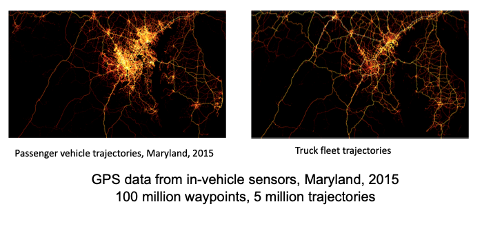

== Tools:  Geospatial Representations and Analytics

Geospatial, analytics, and data science workflows are converging.  This first section in the tools category of the white paper considers several "sovled problems" applied in data rich environment.  Geospatial representations and analytics are well established.  This clause highlights the value that mature geospatial methods uniquely bring to data science. The topics in this clause form a substantial basis for what geospatial data and processing brings to the data science world.

....
“Analytics, data science and location intelligence are converging, at scale, in real time, leading to new challenges you can solve for with these capabilities”
Tod Mostak, OmniSci (formerly MapD)
....

This Clause addresses these topics:

** Maps: cartographic display of data
** Statistical Geography
** Space-Time Analytics
** CyberGIS
** Scientific Computing: Notebooks, Python, R
** GPU-accelerated Geo Analytics
** Recommendations

=== Maps: cartographic display of data

Cartography is the study and practice of making maps. Combining science, aesthetics, and technique, cartography builds on the premise that reality can be modeled in ways that communicate spatial information effectively.

Nearly every presentation in the LP_DS summit contained maps.  Not every map is a study in data science, but maps are a powerful tool for the visual display of data.  Making maps is an art and science that can tell powerful stories, that can be both accurate or deceptive.

For example, this white paper is being prepared during the outbreak of the corona virus outbreak that began in Wuhan China and may be come a global pandemic. While not part of the LP_DS Summit, Kenneth Field - the current Chair of the http://mapdesign.icaci.org/[ICA Map Design Commission]  - blogged on need for https://www.esri.com/arcgis-blog/author/kenfield/[Responsibly Mapping Coronavirus]. Below are two maps displaying the same data.  The first map is a emotive red color, of total cases per province.  Hubei Province is a massive outlier, a really massive outlier that the map above doesn’t properly reflect. The second map tells a more accurate story.

.Corono virus map: red choropleth

.Corono virus map: blue proportional symbol

shows

Field concludes his blog with: "The key to informing is to work with the data and to not imbue it with misguided or sensationalist data processing or symbology" and "pick a technique that supports the telling of that story, process the data and choose symbols that are suitable, and avoid making a map that misguides, misinforms."

Accurately telling stories and conveying experiences with data using maps is a key contribution of geospatial sciences to data science.

=== Statistical Geography

https://en.wikipedia.org/wiki/Statistical_geography[Statistical geography] is the study and practice of collecting, analysing and presenting data that has a geographic or areal dimension, such as census or demographics data. It uses techniques from spatial analysis, but also encompasses geographical activities such as the defining and naming of geographical regions for statistical purposes.

Wendy Martinez, President of the American Statistical Association presented several examples of statistical geography at the LP_DS Summit.  The one shown here is a calculation of inundation of crop area due to Hurricane Harvey.  The figure show both a map and a table.  The map is effective in telling the geographic visualization.  The table is based a geographic analysis based on the fusion of several data layers and the areal calculation function resulting in the precent of inundated land. This is a relatively simple example of geospatial calculation of statistical data.

.Inundation Map and Analysis by USDA

The methods of data science can be seen as emerging from statistics [David Donoho].  The combination of statistics with geospatial science is powerful tool.  The https://nces.ed.gov/FCSM/gig.asp[US Federal Committee on Statistical Methodology] includes a Geospatial Interest Group which coordinates methodological information related to geospatial data across federal agencies.  The FCSM GIG recently held a workshop that considered the question: What are the unique aspects of geospatial data to consider when determining data quality in the context of integrated data products?  Key topics were geospatial representation, error propagation models, geometry and spatial relationships.   Critical issues to be considered when modeling and integrating geospatial data include:

** Geometry of geospatial objects is scale-dependent
*** What level of geometry at different scales?
*** How can we integrate data a different scales/resolutions?
** Spatial relationships between objects
*** Overlap or inclusion
*** Direction
*** Distance

Wendy Martinez concluded her presentation at the LP_DS summit on the topic of data ethics.  Ethics will be addressed in Clause 10 of this white paper.

The https://www.ogc.org/projects/groups/statisticaldwg[OGC Statistical Domain Working Group] is chartered  to identify requirements and use cases of how geospatial and statistical standards can support the integration of geospatial information into the statistical system and for the purposes of broad discovery, analysis and use.  The https://docs.opengeospatial.org/as/15-104r5/15-104r5.html[OGC Discrete Global Grid System standard] has been identified by the Statistical DWG as a standard to considered in their work.

=== Space-Time Analytics

Temporal analytics is an area of excellent research that is becoming increasingly more important and impactful with the availability of data and big data processing.

Kathleen Stewart, UMCP, presentation at LP_DS Summit provides an excellent example of the discussions about temporal analytics during the summit.  Early in the summit there was reference to Kathleen's publication https://www.taylorfrancis.com/books/9780429187117[Computation and Visualization for Understanding Dynamics in Geographic Domains]. Her presentation focused on "New opportunities through big mobility data analytics."  Space-time patterns are available from different data sources: GPS waypoint data, cell phone data, location-based app data, as well as other sensor, e.g., fitness trackers.

In the figure below we see big trajectory data (GPS waypoints transformed into trajectories) useful for highlighting travel behaviors of different groups. We want to expose different dynamic behaviors over space and time. Differences are observed in road transportation for differing vehicles, eg., urban-rural differences. This analysis shows different patterns in those settings which may have differences for risk exposure and planning for major mass evacuation whether it's for flooding or wildfires.

.Space-time trajectories for different vehicles

Spatial-temporal analytics requires trajectory reconstruction algorithms. This can involve: snap way-points of a trip to road segments; and filling segment gaps by heuristic algorithms.

The https://www.ogc.org/projects/groups/movfeatswg[OGC Moving Features Standards Woring Group] considers applications using moving feature data, typically on vehicles and pedestrians. Innovative applications are expected to require the overlay and integration of moving feature data from different sources to create more social and business values. Efforts in this direction are encouraged by ensuring smoother data exchange because handling and integrating moving feature data will broaden the market for geo-spatial information such as Geospatial Big Data Analysis. The Moving Features SWG has created a suite of https://www.ogc.org/standards/movingfeatures[OGC Moving Features Standards]

In Clause 10, the importance of spatial-temporal analysis is discussed in the context of data streaming or "Fast Data."

....
"We finally have the data and computing that we didn't have those many years ago when the research was being conducted. We were talking about trajectory-like objects many years ago and now we have them for real. We are discovering new things that we didn't really think about before because we didn't understand how the technology was going to deliver these things" - Kathleen Stewart
....

=== CyberGIS

https://www.tandfonline.com/doi/abs/10.1080/00045601003791243[CyberGIS is a Framework for the Synthesis of Cyberinfrastructure, GIS, and Spatial Analysis].
Cyberinfrastructure (CI) integrates distributed information and communication technologies for coordinated knowledge discovery. In the linked article, Shaowen Wang describes how CyberGIS provides a framework for the synthesis of CI, geographic information systems (GIS), and spatial analysis (broadly including spatial modeling). The framework focuses on enabling computationally intensive and collaborative geographic problem solving.

.CyberGIS Framework

During the LP_DS Summit, Anand Padmanabhan, University of Illinois, describe applications of the CyberGIS Framework. The CyberGIS approach enabled creation of a flood inundataion map at continental scale.  Hydrologists seeking to address flood mapping on a national scale that had not been done before as it required a scale of computation not previously available. The US National National Hydrography data sets from USGS were used in calculation of Height Above the Nearest Drainage (HAND) based on terrain models. For more information:  https://web.corral.tacc.utexas.edu/nfiedata/docs/NFIE-HAND-Computation.CyberGIS-TechReport-2016005.pdf[A CyberGIS Approach to Generating High-resolution Height Above Nearest Drainage (HAND) Raster for National Flood Mapping]

Anand also presented about CyberGIS-Jupyter for handling big data and analysis  at scale and make this results sharable and reproducible. https://cybergis.illinois.edu/project/cybergis-jupyter/[CyberGIS-Jupyter] project extends the CyberGIS framework for achieving data-intensive, reproducible, and scalable geospatial analytics using Jupyter Notebook. The framework adapts the Notebook with built-in cyberGIS capabilities to accelerate gateway application development and sharing while associated data, analytics, and workflow runtime environments are encapsulated into application packages that can be elastically reproduced through cloud computing approaches. As a desirable outcome, data-intensive and scalable geospatial analytics can be efficiently developed and improved, and seamlessly reproduced among multidisciplinary users in a novel cyberGIS science gateway environment.

=== Scientific Computing: Notebooks, Python, R

Recent advances in scientific computing have being used to deal with big geo data and to advance geospatial data science.  These include the use of notebooks, e.g., Jupyter Notebooks, as well as languages well suited to data analytics such as Python and R.

Jupyter Notebooks have rapidly become a popular method for sharing analysis approaches, linkage to datasets and computation resources in a cloud friendly fashion. Multiple presentations in LP_DS Summit described use of Jupyter Notebooks.  The figure presented by Jay Theodore, Esri, shows how notebooks serve as a container for workflow with links to the computing resources.

.Notebooks in Esri ArcGIS

https://raw.githubusercontent.com/jrjohansson/scientific-python-lectures/master/Scientific-Computing-with-Python.pdf[Python] is a modern, general-purpose, object-oriented, high-level programming language. Python has a strong position in scientific computing with a large community of users, easy to find help and documentation.  There is an extensive ecosystem of scientific libraries and environments: numpy for Numerical Python, scipy for Scientific Python, matplotlib a graphics library. It has great performance due to close integration with time-tested and highly optimized codes written in C and Fortran. Python also refers to the standard implementation of an interpreter (cython).  The most common way to use the Python programming language is to use the Python interpreter to run python code.

Extensions of Python for geospatial computation are available as described https://medium.com/@chrieke/essential-geospatial-python-libraries-5d82fcc38731[here] and https://hub.packtpub.com/libraries-for-geospatial-analysis/[there].  Many OGC members have developed their own extensions to Python.

https://www.r-project.org/about.html[The R programming language and environment] supports statistical computing and graphics.  R provides a wide variety of statistical (linear and nonlinear modelling, classical statistical tests, time-series analysis, classification, clustering, …) and graphical techniques, and is highly extensible. One of R’s strengths is the ease with which well-designed publication-quality plots can be produced, including mathematical symbols and formulae where needed. There are numerous resources for introduction to Python data science "ecosystem", e.g., https://jakevdp.github.io/PythonDataScienceHandbook/[Python Data Science Handbook] is quite comprehensive.

Extensions of R for geospatial computation are available as described https://cran.r-project.org/web/views/Spatial.html[here] and https://geocompr.robinlovelace.net/intro.html[there].

https://portal.ogc.org/files/91644#PartEOPADJ[OGC Testbed 16] will be addressing Earth Observation Application Packages with Jupyter Notebooks.

http://www.ogcapi.org/[OGC APIs] are being developed independent of programming languages but intended to be compatible with taking advantage of Python and R.

The adopted https://www.ogc.org/standards/geoapi/[OGC GeoAPI] standard provides a Java API.  http://www.geoapi.org/snapshot/python/index.html[A Python profile of GeoAPI] is under development.

=== GPU-accelerated Geo Analytics

GPU based computing is improving the performance of many of the topics listed earlier in this Clause. (Heterogeneous computing beyond GPUs is address in Clause 10.)

Tod Mostak, OmniSci, performed a demonstration in LP_DS Summit that showed the intersection of analytics and data science based on the GPU accelerated calculations.  The demo included visualize aircraft flight tracks as 5 billion points.  The calculations included spatial bins in seconds and pivoting this table to generate a huge SQL query behind the scenes.  The GPU accelerated k-means algorithm which takes only seconds. The points were then then clustered and visualized as trajectories.

The OGC Community Standards for 3D Visualization https://www.ogc.org/standards/3DTiles[3DTiles] and https://www.ogc.org/standards/i3s[i3S]  make use of GPU accelerated visualization through use of the Khronos Group GL Transmission Format (glTF). glTF is an efficient, extensible, interoperable format for the transmission and loading of 3D content. glTV was developed to mirror the GPU APIs.

Milind Naphade, described how NVIDIA created cuSpatial: a free library for GPU acceleration of common spatial operations as listed in the figure.  The acceleration provides the instantaneous results of hypothesis testing, e.g., clustering, bu several orders of magnitude acceleration.

.cuSpatial - GPU Acceleration of common spatial processing functions

=== Recommendations

Recommendations for consideration by the OGC Big Data Domain Working Group:

** Promote development of Big Data Stack approaches for Spatial-temporal analytics and Streaming analytics
** Promote development of OGC Community Practices for for geospatial cyberinfrastructure, e.g., CyberGIS
** Promote discussion and development of computing using Notebooks, R and Python-oriented APIs, e.g., results from OGC Innovation Program initiatives.

Recommendations for consideration by the Moving Features SWG and Temporal DWG:

** Promote development of OGC Community Practices for spatial-temporal analytics.
** Propose use cases for Edge Computing: temporal analysis of streaming data

Recommendations for consideration by the Statistical DWG

** Promote development of OGC Community Practices for geospatial data science based on Statistical Geography
** Promote discussion of the Impact of big data platforms analytics on statistical geography

The OGC Testbed 16 results regarding notebooks and python-oriented APIs should be considered by OGC, e.g., the OGC Big Data DWG and Earth Observation Exploitation DWG.
