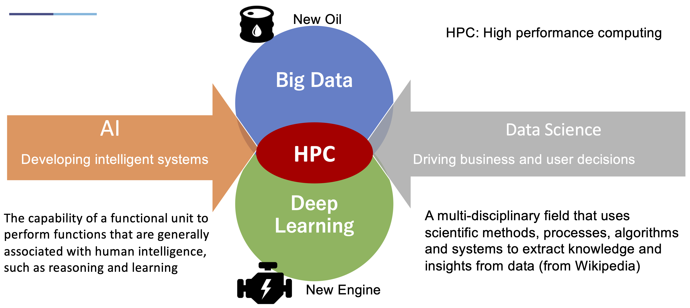
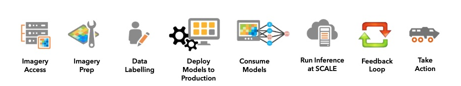
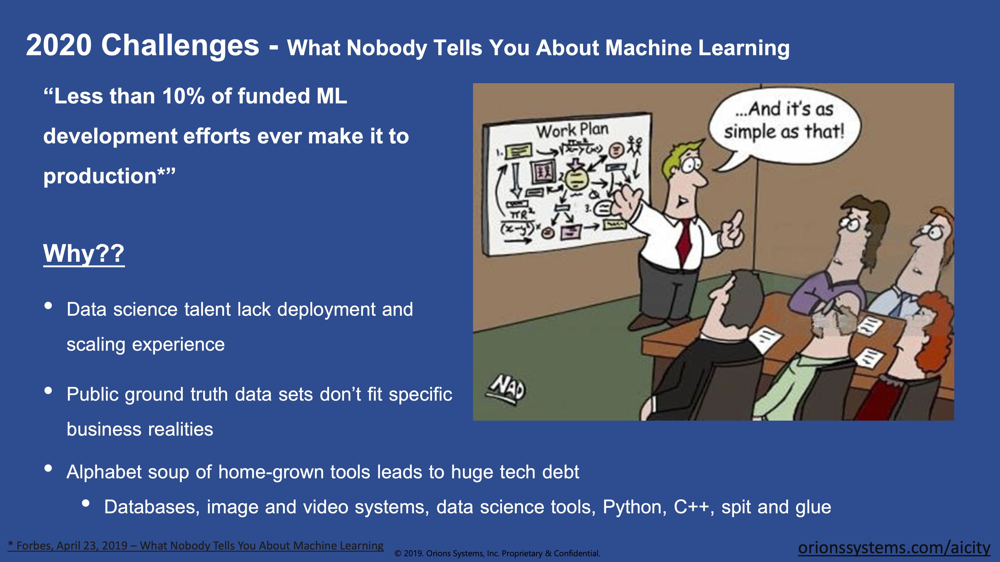

== Tools: AI and Machine Learning for Geospatial

This clause addresses how recent advances in Artificial Intelligence, in particular Machine Learning, have been applied to geospatial data.  The application of machine learning to geospatial data is described here as a significant advance in geospatial data science.

This Clause contains these sections:

** The emergence of Artificial Intelligence
** Challenges with AI
** Training Sets and Benchmarks
** Augmenting Machine Learning
** Look forward to the future of AI
** Recommendations

=== The third emergence of Artificial Intelligence

Artificial Intelligence is in its third generation of technology development. In the LP_DS Summit, Satoshi Sekiguchi, AIST, presented a figure showing these three generations: where the top half of the diagram shows development of AI as rule-based, symbolic manipulation with inference engines; and the bottom half address data driven AI based on pattern recognition and machine learning. In this clasue the emphasis will be on Machine Learning.  Knowledge Graphs as a form of AI will be considered in Clause 8.

.Generations of Artificial Intelligence development
image::figures/FIG07.01_Generations_of_AI.png[600,600]

The recent advances in machine learning has been driven in large part by the ready availability of training data commonly based on computer vision benchmark datasets such as Imagenet etc.  Satoshi Sekiguchi portrayed this as an  advancement in Data Science where the New Oil (big data) meets the New Engine (deep learning with high performance computing and big data computing).  Within HPC, Satoshi considers traditional HPC applications including mathematical or physical models. The mixing of augmenting machine learning training based on data with hypothesis and models will be address later in this clause.

.AI/Machine Learning and Data Science

Several discussions about AI and Machine Learning are captured in these quotes

** "CEOs of the big companies 40% of the top performers think that AI is going to be a game-changer for the industry; bigger than cloud, mobile, IoT, blockchain or APIs"  - Philippe Cases
** "AI is a social construct more so than a set of technologies - this is based on analysis of more than a hundred thousand documents in data science and analytics" - Andre Skupin
** "Mostly what were are doing in geospatial is using machine learning" - group
** "Only machine learning can help scale to consume the exponential growth of video streams" - Nils Lahr
** "What we've been doing is trying to solve complex problems using tools;	it's about trying to solve problems" - group
** "Need to consider both AI and intelligence augmentation" - group

Jay Theodore, Esri, provide an example of how Machine Learning for imagery can be deployed as shown in the Figure.  The full workflow where you collect the data, prep the data you use it for training, then  build and validate models, deploy them and then once you deploy them you probably want to run the inferencing at scale.  This is the full end-to-end workflow that typically might happen in the cloud.  Then for deploying to the edge  you pick and choose what you want to do at the edge and deploy it at the edge.  You might train the model at the edge to avoid sending the data to the cloud. Train the model at the edge so no privacy laws are broken by pushing data up to the cloud.

.Machine Learning with Imagery life cycle by Esri

An example of the effectiveness of machine learning is presented here.  Several more examples will be presented as applications in Clause 9.  Regan Smyth, NatureServe, has applied machine learning to mapping of species habitats.  The figures shown here are predicted habitats regions for a type of salamander.  The figures depict the improvement in predicted suitability of the right over the left map. Furthermore, the efficiency of making these maps is greatly improved with machine learning.  In the past year NatureServe has done this for 2,000 species by pulling together data collected by hundreds of people in the field building a kind of cloud-based environment where we  have a team of scientists collaborating on the modeling and then using tools to get that information  back out to our scientists to review it and tell us how well the models have done.

.Effectiveness of Machine Learning in habitat identification
image::figures/FIG07.04_ML_Results_Salamander.png[700,700]

=== Challenges with AI

While there are many examples of the benefits of machine learning, there was a substantial disucssion in the LP_DS Summit about the current challenges with machine learning. The figure below was presented by Nils Lahr, depict multiple of the challenges discussed.

.Current Challenges with Machine Learning

Challenges with Machine Learning are reflected in these quotes from the workshop:

** "Now there a lot of "hello world" experiments. What we need are real world solutions; pushing these experiments into real production to build trust. What's needed is the core engineering of building end-to-end systems." - Milind Naphade
** "The biggest challenge is lack of data. Some companies have the resuorces to acquire the data they need to make progress but and there are small companies along with niche applications that don't have sufficient data.  Ecosystems are developing to gather enough data to gain confidence in decisions." - Anand Kannan
** "Benchmarks data sets with labels are needed to develop the systems so end users can actually start having confidence that this really works" - Milind Naphade
** "There is a lack of geospatial training data catalogs. This leads to biased or incorrect results and the inability to capture wide range of possible outcomes in space and time" - Hamed Alemohammad
** "A really good vehicle detection model in the Midwest US may look very different than a really good vehicle detection and tracking model in Shanghai or Beijing or Mumbai." - Milind Naphade, NVIDIA Metropolis
** "You can create all the models you want all day long and then all of a sudden something real happens and you realize that the models aren't what you needed" - Nils Lahr

=== Training Sets and Benchmarks

http://www.image-net.org/[ImageNet] is an image database organized according to the WordNet hierarchy (currently only the nouns), in which each node of the hierarchy is depicted by hundreds and thousands of images. Since 2010, the ImageNet project has run an annual software contest, the ImageNet Large Scale Visual Recognition Challenge (ILSVRC), where software programs compete to correctly classify and detect objects and scenes. ImageNet and the annual ILSVRCs have been essential to advancement of Machine Learning.  According to an article in https://www.economist.com/special-report/2016/06/23/from-not-working-to-neural-networking[The Economist] the current excitement about the field, can be traced back to 2012 and an online contest called the ImageNet Challenge.

Several activities have geospatial data sets comparable to ImageNet:

http://bigearth.net/[BigEarthNet] - a benchmark archive constructed by TU Berlin with European Research Council funding - consisting of 590,326 Sentinel-2 image patches from atmospherically corrected tiles acquired between June 2017 and May 2018 over the 10 European countries.  Each image patch was annotated by the multiple land-cover classes (i.e., multi-labels) that were provided from the CORINE Land Cover database of the year 2018.

https://spacenetchallenge.github.io/[SpaceNet] is a corpus of commercial satellite imagery and labeled training data to use for machine learning research.   SpaceNet focuses on four open source key pillars: data, challenges, algorithms, and tools. SpaceNet Challenge Dataset’s have a combination of very high resolution satellite imagery and high quality corresponding labels for foundational mapping features such as building footprints or road networks.

During LP_DS Summit, Hamed Alemohammad, Radiant Earth, applauded the BigEarthNet and SpaceNet activities, while also pointing out that more work is needed on training datasets and benchmarks to address problems like the lack of diversity, accessibility of data, interoperability of data sets, and the readiness for ML.  https://www.radiant.earth/about/[Radiant Earth] is actively working to develop Earth observation machine learning libraries and models through an open source hub that support global missions like agriculture, conservation, and climate change. Radiant Earth also fosters a community of practice to develop standards around machine learning for Earth observation and provide information on the progress and innovation in the Earth observation marketplace.

Several discussions about Benchmarks and Training Data sets are captured in these quotes:

** "The quality and source of training data really is a key issue. Also identifying what the correct the best or the good sources of data both data sets and data sources really are and we thought it was interesting that the level of confidence in the data and the outcome is related to the application some applications need more and some less level of confidence.""
** "Building on a geospatial image repository is not as simple as ImageNet."
** "HERE technologies talked about the challenge of maintaining a training set of data that has a temporal characteristic. They need to continuously re-annotate and continuously look to make sure that you got a representation of ground truth."
** "I can't tell you how often we've built a model based on synthetic data with exciting results and then we threw real data we're very disappointed"
** "A theme of our discussion was sharing more whether it's data or whether it's modeling but then also making sure that we have an idea of what the quality is and you know how stale is our data and how good is your model and being able to communicate that as well."

=== Augmenting Machine Learning

The previous sections have discussed the hype and challenges associated with AI and Machine Learning.  The Training Sets and Benchmarks describes concrete methods underway to improve geospatial machine learning.  Additional ideas for addressing the challenges and improving machine learning were also discussed.

** The Role of Domain Experts.  Clause 4 discussed the role of domain experts as members of multi-disciplinary data science teams.  Domain experts can play a key role in the effectiveness of machine learning.  Jay Theodore discussed how we have to solve important problems if we need to make this trend useful and for that what we need is domain expertise; Without domain expertise we cannot make AI come to life in a meaningful way.

** Humans in the loops.  Nils Lahr described how they built algorithms with humans plugging in their expertise at different levels in the overall ML process. The humans provide input that ML can't do.  With his example of basketball analysis, there was a real-time/court side loop, along with the upper cognitive layers that come about five minutes after the game concludes.

** Finding a Balance.  Regan Smyth described how there is a balance between tweaking the computing to optimize your outputs and tapping into that human knowledge that's a little bit more variable. That's something we're thinking about a lot is can you use the input you receive as initial iterations to figure out systematically what's going wrong and update your methods to address it or do you somehow need to structure your data.

** Combing the parts.  Use a combination of use machine learning for specific parts of the model not for the whole pipeline. You'll be able to automate retraining specific parts of the model but not the entire model.  No model should go without being paired with a calibrated eyeball. Too often people read in the machine learning as human replacement when in reality it's a force multiplier.

** Theory Guided ML.  Yolanda Gil presented work by [Kumar et al 2017] and [Karpatane et al 2017] Kumar and his group at Minnesota incorporating knowledge about physics that constrains what the machine learning models learned.  The application was to land use and what kind of crops grow in different areas. They've created this concept of virtual gauges for the river that includes knowledge about physical constraints. Karpatane considered Physics-Guided Neural Network where the learning is consistent physically with what's going on in physics. In this way,  knowledge about the world guides the machine learning methods to do better.  More will be discussed on this topic in Clause 8.

=== Look forward to the future of AI

Yolanda Gil recommended that we consider https://cra.org/ccc/wp-content/uploads/sites/2/2019/08/Community-Roadmap-for-AI-Research.pdf[A 20-Year Community Roadmap for Artificial Intelligence Research in the US]. Decades of research in AI have produced formidable technologies that are providing immense benefit to industry, government, and society. AI systems can now translate across multiple languages, identify objects in images and video, streamline manufacturing processes, and control cars. The deployment of AI systems has not only created a trillion-dollar industry that is projected to quadruple in three years, but has also exposed the need to make AI systems fair, explainable, trustworthy, and secure. Future AI systems will rightfully be expected to reason effectively about the world in which they (and people) operate, handling complex tasks and responsibilities effectively and ethically, engaging in meaningful communication, and improving their awareness through experience.

In the near term we conclude this clause with the Keys to Success for Machine Learning presented by Regan Smyth, based on her NatureServe projects:

** Standardized, ground-truthed Training Data
** Partnerships between tech and front line actors
** Human-mediated review of ML outputs

=== Recommendations

It is recommended that the OGC GeoAI Domain Working Group consider:

** Promoting development of OGC Community Practices for geospatial machine learning.
** Promoting development of training sets and benchmarks for geospatial machine learning, e.g., in coordination with ESA and Radiant Earth Foundation.
