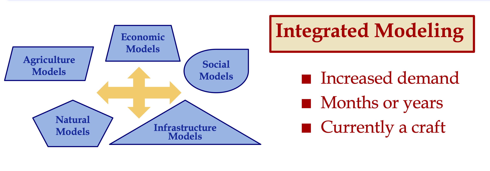
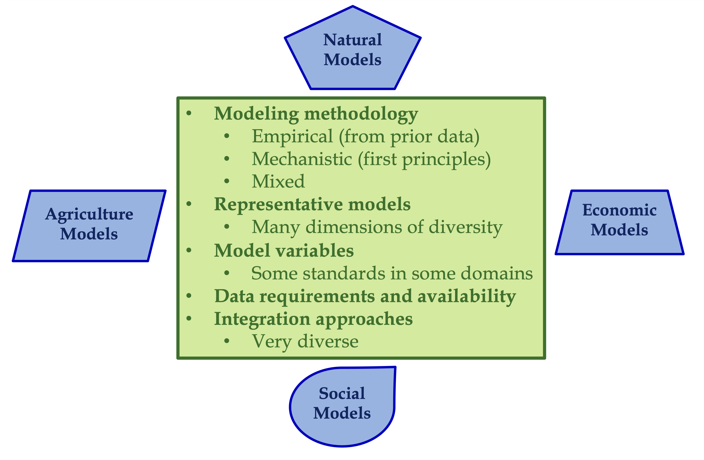
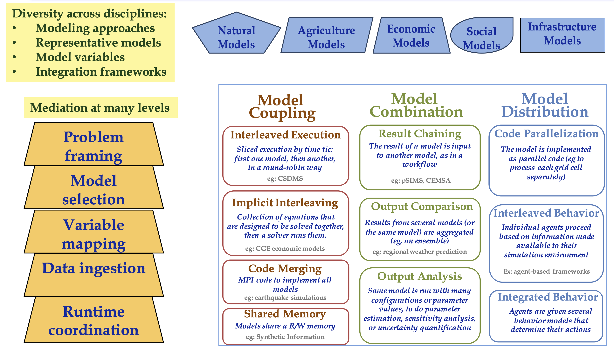
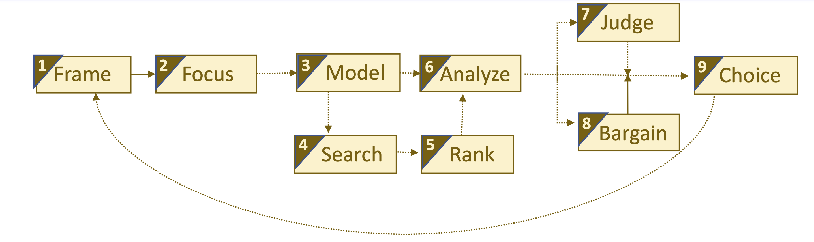
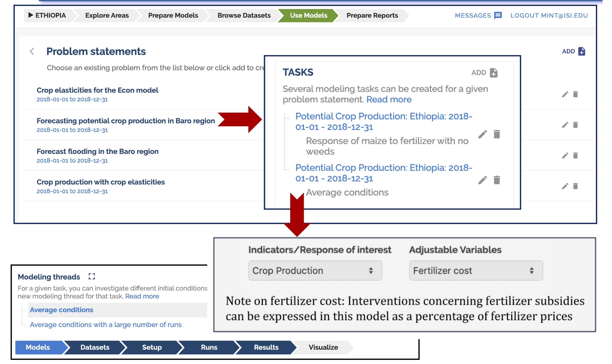

== Tools: Models and Decisions

This clause addresses how knowledge-powered data science can improve decision making.

This Clause contains these sections:

** Knowledge Powered Data Science

** Integrated Modeling

** Model Integration Framework

** Model-supported Decision Making

** Recommendations

=== Knowledge Powered Data Science

Yolanda Gil, USC, presented on "Knowledge-Powered Data Science for Integrated Modeling in Geosciences."   The call to action for this presentation was encapsulated in this outline.

** Focus shifted from data to models:

*** Model Characterization, reuse, and integration.

** Need to incorporate model-centered science knowledge about phenomena and context:

*** Knowledge about physical, geological, chemical, biological, ecological, and anthropomorphic factors; and

*** Knowledge about the user goals and context.

** This would enable novel forms of reasoning, integrating, visualizing, managing, learning, and discovery with geosciences data.

Yolanda discussed how this is a very big shift. We need to address the challenges in characterizing reusing and integrating models.  To harness data and to develop useful models for decision-making we need to incorporate a lot of science knowledge about these models and the data that they use. We need a diverse set of models for accessible knowledge about physical, geological, chemical, biological, ecological, social, economic factors.  We need knowledge regarding what a user might want to do with that model.  By infusing our systems with more information and more knowledge, using these models will enable new forms of reasoning, integration, visualization, management, learning, and discovery about the geosciences data at large.

Annie Burgess, ESIP Federation, summarized the modeling discussions as focusing on adding knowledge and how it enables more automated and less manual modeling. What works is the idea of provenance and capturing that provenance in models.  Everything within this modeling needs to have a URI to point to an explanation of the models.

=== Integrated Modeling

There always has been great demand, but there always has been a human bottleneck of manually setting-up and integrating these models. It takes months or years to put together models for these kinds of problems and it is really a craft very few people understand how to do and so it is very hard to integrate a pair of two natural models.

.Grand Challenge for Geospatial Data Science

It is really, really, hard to integrate models across disciplines even if both are physical models. Imagine if you try to integrate social economic models with agriculture models. We will have a better world if we manage to do integrated modeling.  If we can do integrated modeling, well then we can do many other things really well. We can do data preparation really well; we can do single model reuse really well; etcetera. This is a grand challenge, worth doing.

=== Model Diversity and Integration Challenges

Diversity of models from different disciplines is required to meet the data science and decision needs.  With the thematic diversity also comes a diversity of modeling approaches.  Integration of the models must address these different types of diversity

.Modeling in Different Disciplines: Diversity of Approaches

Hydrology models may be using an irregular grid where they can look at physical variables in each one of those grid cells. There is a lot of physics involved and the complexity can be enormous, but the system can also be simplified and modeled on a coarser level. The model needs a lot of historical data to adapt the general physics and fluid equations to that particular area. This generates very useful information about the times and days where particular grid cells are flooded so the models are very important but they have this flavor of very rich physics based modeling.

In contrast agriculture models tend to be more focused on biophysical processes. With respect to the growth of the plants and weeding practices, different crops behave differently.  These models look at different versions of the crops or different genetic variants and bio-geophysical processes. So this is not so much the physics, but processes that are dynamic.

Social models tend to look at societal behaviors through agent-based modeling where you have different groups of agents doing certain behaviors. You can define groups of agents that have children and the children will go to school and so they are able to do the farming or something else. You define all of these behaviors and you see the dynamics of how the system evolves and behaves over time.

So if you are trying to understand and integrate two of these models, they work at such different scales they have such different methodology. Some of them are based on theory, some of them are empirical, some are modeling variables that are very different in the physical world. Models with more data and more types of data do a better job. But there may not be so much data availability and the the ways in which you integrate two models that both look at physics is very different from the way that you would integrate with a social model.  So the challenges are many.

=== Model Integration Framework

Research has been done to develop a framework for integrated modeling.  We need the ability to incorporate knowledge into our data science systems to improve the way that we do modeling.

.Integrated Modeling: Bridging Across Disciplines

The framework includes several levels in order to address the diversity.  The framework was developed in the http://mint-project.info/[MINT project] which provides Model Integration through Knowledge-Rich Data and Process Composition.

=== Model-supported Decision Making

The major value of model development is to improve decision making.  The models represent the accumulated knowledge that can them be applied to the decision making process.  The models become a key element in the iterative process to model, analyze, judge, chose, or repeat.

.Decision Making with Models

Yolanda's research involves the addition of a key element in decision making - interventions.  As as part of the iterative decision making loop, different values of input parameters can be introduced as intervention towards affecting outcomes.  Varying values in subsequent model runs provides a range of alternative outcomes.  The decision making this informed by the choice against alternative outcomes.

For example in a crop forecasting model, the adjustable variables may be fertilizer costs.  By studying a range of fertilizer costs, available budget and, the resulting crop production, a decision is informed by the knowledge-driven framing based on model indicators and adjustable variables.

.Knowledge Driven decisions

=== Recommendations

** Identify the needs for consensus standards in the MINT model integration framework, e.g., data formats coming from different disciplines.

** Expand the discussion on Knowledge Powered Data Science to additional types of models, e.g., models for the built environment, models for training, simulation, and gaming.

** Engage the OGC Interoperable Simulation and Gaming DWG in discussion of Knowledge Powered Data Science.

** Update the Model, Simulation and Prediction Roadmap in the OGC Tech Trends based on this Clause.

Geospatial Data Science recommendations for the OGC ISG DWG:

** Promote development of Knowledge-Powered Data Science to additional types of models, e.g., models for the built environment, models for training, simulation, and gaming.
