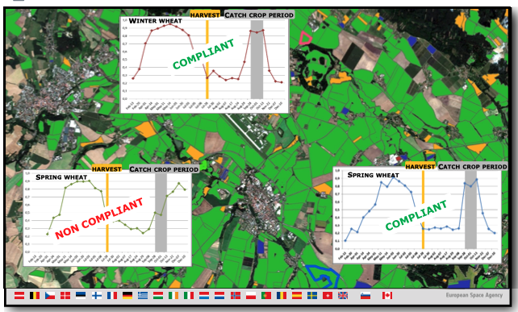
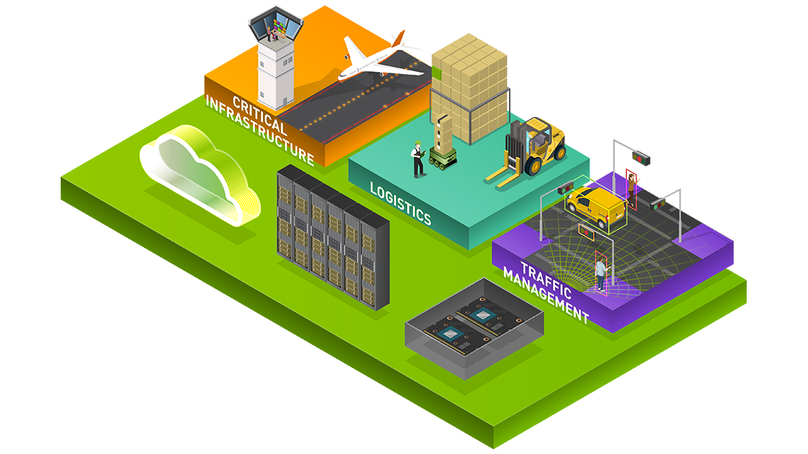
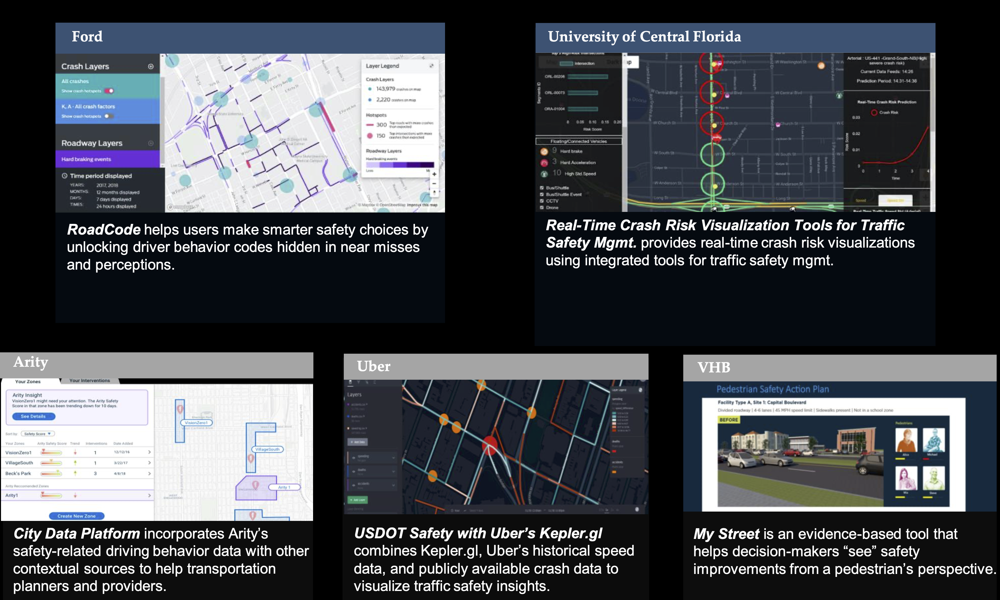

== Data Science Applications and Ethics

This clause provides examples of the application of geospatial data science.  The objective is to show the value of the data and tools discused in earlier sections.  With the application of the data science technology, ethical issues emerge.

This Clause contains these sections:

** Natural Resources and Agriculture
** Urban Data Science
** Emergency Management / Disaster Response
** Health
** Intelligence
** Business and Insurance
** Geospatial Data Science Ethics
** Recommendations

=== Natural Resources and Agriculture

Patrick Giffiths, ESA, provide an example of agriculture monitoring using data science.  The motivation for the Copernicus program to support European policies. One of the major European policy elements that has benefited from the Sentinel data is the Common Agricultural Policy. CAP is the single biggest fiscal budget item in Europe at 43% of the total budget of the European Union.  Mainly it pays subsidies to make agriculture economically viable for the farmers. But it also has elements for enforcing environmental policies and sustainable agriculture. The CAP compliance checks for receiving subsidies  is traditionally done through interpretation of a very high resolution imagery for a 5% sample per country and then for a smaller percentage of those parcels there is spot checks in in addition to the VHR imagery interpretation to determine the compliance.  This is complicated and inefficient. Fully automated monitoring based on Sentinel time series and data analytic tools basically from the data science community is a big step.  The Figure from http://esa-sen4cap.org/[ESA's Sen4CAP project] shows the results of this new process.

.Machine Learning supported Agriculture policy compliance

Recall these example applications presented earlier in this document:

- Crop inundation application in the Geographical Statistics Clause 6.
- Biodiversity application in the Machine Learning Clause 7

=== Urban Data Science

The City of Los Angeles has several data science projects improving the lives of urban residents, as described by Jeanne Holm, City for Los Angeles:

** SmartAirLA/Predicting What We Breathe collects data from satellites airborne instruments and ground data sensors from  Internet of Things across the city of Los Angeles and across the region. The data is federated in a way that helps to use machine learning to create predictive analytics about the quality of air. LA is partnering with other mega cities around the planet to see patterns can be evoked from satellite data to understand things that are happening on the ground. In Mumbai for example where they may not have as many ground data sensors, it's a pretty interesting experiment.
** ShakeAlert LA is an earthquake early warning system. It gives you up to minutes warning that you are about to feel shaking from an earthquake. In Los Angeles and so we have over a million users and they partner with the USGS ShakeAlert system which has sensors up and down the west coast. The app technology and  latency and the network was tricky, but it's a lot about behavioral nudges and behavioral science to get people to be safer during an earthquake.

https://www.nvidia.com/en-us/autonomous-machines/intelligent-video-analytics-platform/[NVIDIA Metropolis] create IoT applications, from the edge to the cloud, for retail,  inventory management, traffic engineering in smart cities.  Milind Naphade, NVIDIA Metropolis, presented at the LP_DS Summit about their system for workloads that run at the edge for video data. Processing video for traffic monitoring and analytics detects objects at 50 objects per frame that's 1.5 million messages per second. With video plus geospatial  every object that detected is labeled with GPS coordinates, we convert the video into the real world map based understanding. This for example allows for anomaly detection, e.g., where a vehicle was detected driving in the wrong lane.  This would allow for real time response like switching the traffic lights to red, police vehicle  escorting the vehicle off of the road, etc.

.NVIDIA Smart Cities

Ed Strocko, US DoT, provided a focus on transportation safety. Over 36,000 people die on highways every year. This is way too high.  The five examples in the Figure are from a data visualization organized by DoT.  The Central Florida example used machine learning to do short-term predictive analytics on where a crash is going to occur; where do we think we need to be focusing our attention changing the variable speed limit signs; giving the infrastructure operators some information. Ford and Arity were looking at the behavioral information coming off the cars; hard stops, hard starts, people using cell phones and using some data science in there to get that get down that number of fatalities. These developments need to continue until we can really achieve that that vision of a much safer road with autonomous and connected vehicles

.US DoT Transportation Safety Data Visualization Challenge

To support many of the urban use cases, High Definition (HD) Maps are needed. Standardizing HD maps is contrasted with today's mapping systems.  Information for autonomous vehicle needs to be HD. Standard for HD map data in a format that can be understood by not just the cities but software in general and the other scientists at large. We need to look at the policy comes together. But it's definitely the collaboration across the spaces there to get to something.  Jeremy Morley, Ordannce Survey UK, discussed how from a national mapping agency perspective as well for the UK, there's interesting questions also as to whether when we talk about HD roads or just interested in that CAV market.  It's not just a single map that each of fleets will want.  And how well does it serve other purposes as well whether it's the IOT market or simply local authorities better maintaining their assets. There's a way to go to accumulate enough evidence as to what is a good product or standard in this space.

=== Health

Stephanie Shipp, U. of Virginia, presented on Harnessing the Power of Data to Support Community Health and Well-Being.  She described the Community Scapes program that identifies where to target programs and policies for communities with risk of obesity. A key part of the data analysis was re-distribution of source data using synthetic information.  The project used American Community Survey (ACS) summaries and ACS Public Use Micro Data Sample (PUMS) to impute synthetic person data for all people or households in area of interest.  The data was re-weighted synthetic data according to ACS tables to simultaneously match the relevant distributions, to Census Tracts or Block Groups.  The aggregate synthetic data was used to compute summaries, and margins of error, over the new geographic boundaries or interest as shown in the figure.

.Identifying communities with risk of obesity
image::figures/FIG09.04_CommunityScapes.png[500,500]

Wendy Martinez, US BLS, described how the US Center for Disease Control maintains an environmental Public Health tracking network with information on environmental hazards and the health effects associated with the hazards.  Such health data can be applied for planning and health interventions.

Ajay Gupta, led a group discussion on health that examined the need for both population level and precision precision level location data:

** utilizing patient-level individual data to understand their daily exposure to environment what type of environment whether it's physical environment or nature environment including air quality noise and how does that impact their health outcome.
** Predictions using GeoAI technology to understand the moment of eating. With heart failure patients it's very important to identify high propensity of eating in order to suggest nearby healthier options.
** The Supercomputing Center at UC San Diego is utilizing satellite imageries and sensor survey data  to understand a neighborhood characteristic and the risk factors that directly impact certain health or certain disease outbreaks.

=== Intelligence

Nils Lahr provided an example from the National Geospatial-intelligence Agency (NGA).   The NGA workflow for real-time video from UAVs is shown in the Figure.  The system manages processing of a hundred drones.  The analysis is about where and when. Gathering patterns of life not just as whole bunch of data points but things that matter in the field.  The patterns are a level of intelligence that we have not been able to do at scale.

.NGA drone video processing workflow
image::figures/FIG09.05_NGA_workflow.png[500,500]

=== Business and Insurance

Nils Lahr presented several examples from the world of business

** Hedge funds are making use of video analytics of Walmart parking lots. Public data feeds on Black Friday before Christmas, or maybe even three months before, to start predicting how people are going to spend money at certain times. Algorithms are used to figure out to place bets on the future. In this case it's not only where the cars are located in terms of the globe but literally where they are in the parking lot.
** Logistics in handling new automobile shipments involves moving ten thousand cars per day on thirty acres of parking lot. Need to plan for what cars are leaving tomorrow to get them close to the train. This is a localized geospatial application: how do you tell the one guy to go to the one car that he needs and how do you know the car is there. The input video comes from UAVs reading the VIN numbers along with light posts with wide area cameras. Geospatial information essentially GPS is used to create a digital twin of the parking lot. The digital twin is used to optimize the logistics of moving the cars.

An LP_DS discussion group focused on geospatial data science applied to insurance:

** Satellite imagery is helping the insurance industry you know a lot of for example the use case is underwriting
**  Insurance policy applications are includes much risk information that is pre-populated based on address.
**  Use of geospatial information for the allocation of claims adjusters along with a rough sense of the damage before going to the site.
** Catastrophe modeling, e.g., earthquakes, flooding, in advance for risk assessment. Requires a very high level of accuracy, e.g, for just a few meters for the water damage
** Insurance is very location-based. With all the information, from imagery and from modeling, enriches the underwriting process.

=== Emergency Management / Disaster Response

Jay Theodore, Esri, asked the question of an LP_DS panel: "what's the most meaningful and satisfying project you've been involved in applying data science?" Devaki Raj responded about the application of data science to disaster response.

Devaki Raj, CrowdAI, provided examples of applying machine learning to the to hurricanes in Houston and Florida; and about the Santa Rosa and Campfire Fires in California.  She spoke responding to the  largest operational challenges that often occur after major natural disasters.  CrowdAI uses different types of third-party imagery, e.g., satellite, drone, aerial.

- Hurricane assessments.  With Hurricane Harvey CrowdAI mapped all the roads on imagery prior to the event; and then mapped all the roads on post flooded imagery. This roads condition were converted from TIFF file format into GeoJSON vectors and provided to first responders. For Hurricane Michael in Florida, NOAA aerial imagery was used to identify building damage based on mapping of almost 18,000 buildings in a couple of minutes.
- Wildfire assessments.  For the Campfire wildfire in California they applied a model that had been trained with Digital Globe imagery from 125 countries.  After Campfire, 25,000 buildings were mapped off of the imagery that Digital Globe had on their open data platform. At 30 centimeter resolution, pre-fire buildings were mapped as 25,000 polygons.  The post fire assessments were at the level of individual houses as the aggregate was not useful. In the same neighborhood some buildings were standing and some are completely destroyed.  Mapping after the Santa Rosa fires was used for risk mitigation.  Imagery analysis with machine learning identify wildfire risk factors for a future fire.  This was to mitigate risk potentially from a future disaster.

The application of Statistical Geography provides data science methods to assess the social impact of a hurricanes.  The Bureau of Labor Statistics mapped the affect of storm surge due to a hurricane hitting Virginia coastal areas.  Using the Quarterly Census of Employment and Wages (QCEW), they calculated the employment in the various geographical flood zones.

.Employment in Hurricane Storm Surge Flood Zones, Virginia
image::figures/FIG09.06_Employment_Hurricane.png[500,500]

Examples of emergeing response from previous clauses:

** Near Real-Time Flood Mapping of Agriculture by the USDA National Agriculture Statistics Service as in the Statistical Geography section of Clause 6.
** Mapping Flood Inundation at continental scale in the CyberGIS section of Clause 6.

=== Data Science Ethics

With the application of data science comes the question of ethical use of the data and the associated analytics.  The technology and data we have described in earlier paragraphs could be applied in a variety of ways good or bad.  It's with the application of technology that issues of ethics arise.

....
Technology is neither good, bad; nor is it neutral
- 1st Law of Technology (M. Kranzberg)
....

Wendy Martinez, provided an outline of Data Ethics.  She described Ethics as: the study of right and wrong; as the set of moral principles governing our behavior; and as often abstract, guidelines.  Data Ethics is a "branch of ethics...moral problems related to data, ...algorithms, ... and corresponding processes.

https://royalsocietypublishing.org/doi/full/10.1098/rsta.2016.0360[Three Axes of Data Ethics]:

** Ethics of Data: Collection and analysis of large datasets
*** Re-identification of individuals - geospatial concern?
*** Trust and transparency
** Ethics of Algorithms: Increasing complexity and autonomy of algorithms (e.g., Internet of Things)
** Ethics of Practices: Responsible innovation, R&D, usage  - foster innovation and protect rights
*** Informed consent (Web-scraping??)
*** User privacy and surveillance
*** Secondary use - integration of data sets
*** Unintended use

Wendy provided three examples were discussed.  The first was on racial bias in medical algorithms.  The algorithm underestimated health needs of sickest black patients.  Mapping highest scores showed concentration in affluent suburbs.  The second was on Predictive policing software.  The software focused on already hotspot areas, leading to geographic profiling. Adding police resulted in an increase in reports.  The resulting spike was used as justification.  The third was on autonomous vehicles, what should a vehicle algorithm do when faced with several undesirable choices.

References on data ethics.

** https://www.nature.com/articles/d41586-018-07135-0[Self-driving car dilemmas reveal that moral choices are not universal]
** https://www.reuters.com/article/us-amazon-com-jobs-automation-insight/amazon-scraps-secret-ai-recruiting-tool-that-showed-bias-against-women-idUSKCN1MK08G[https://www.reuters.com/article/us-amazon-com-jobs-automation-insight/amazon-scraps-secret-ai-recruiting-tool-that-showed-bias-against-women-idUSKCN1MK08G]
** https://washingtonmonthly.com/magazine/junejulyaugust-2017/code-of-silence[Code of Silence:
How private companies hide flaws in the software that governments use to decide who goes to prison and who gets out.]
** https://www.washingtonpost.com/health/2019/10/24/racial-bias-medical-algorithm-favors-white-patients-over-sicker-black-patients/[Racial bias in a medical algorithm favors white patients over sicker black patients]
** https://www.washingtonpost.com/technology/2019/10/22/ai-hiring-face-scanning-algorithm-increasingly-decides-whether-you-deserve-job/[A face-scanning algorithm increasingly decides whether you deserve the job]

Data Science Ethics is not just an abstract discussion.  The application of data science technology can bring harm.  The questions about technology can prevent its application.  Philippe Cases, Topio Networks, discussed ethics and principles in the context of AI and edge computing: we cannot compare the new technology to some absolute standard; the appropriate approach is to identify the advantages and minimize the risks.

Andy Brooks discussed the intersection of AI and ethics. With  regard to counterterrorism its a discussion about targeting and lethality.  It's not just an academic discussion or model. What's the ethics of using automata to do a certain type of work?

Andy Brooks discussed the implications of AI on workforce.  Previously it would take say ten people two weeks to do one thing, and now it takes  one person clicking on a script and its done in ten minutes. There's a lot of implications for that with regard to employment and workforce and staffing.

Ethical issues particular to geospatial data science are highlighted by handling of location data and location privacy.  LP_DS discussed that it is very difficult to make data anonymous when it contains location information about individuals.  In particular trajectory data about individuals has been shown to be de-anonymized rather easily. Strategies for data ethics were discussed such as relating to edge computing.  Keeping the most descriptive data on individuals at the edge and passing the most general information to the cloud was discussed.  There was also a call for a Geospatial Data Science Code of Ethics.  Some of the approaches suggest masking or otherwise degrading the data.  Stephanie Shipp advocated that when it comes to data privacy, don't mask the data but rather punish misuse.

=== Recommendations

** Identify and promote additional applications of geospatial data science.
** Identify and promote community practices for geospatial data science ethics.

It is recommended that the OGC GeoAI Domain Working Group consider:

** Promoting development of a Geospatial Data Science Code of Ethics focused on Artificial Intelligence.
