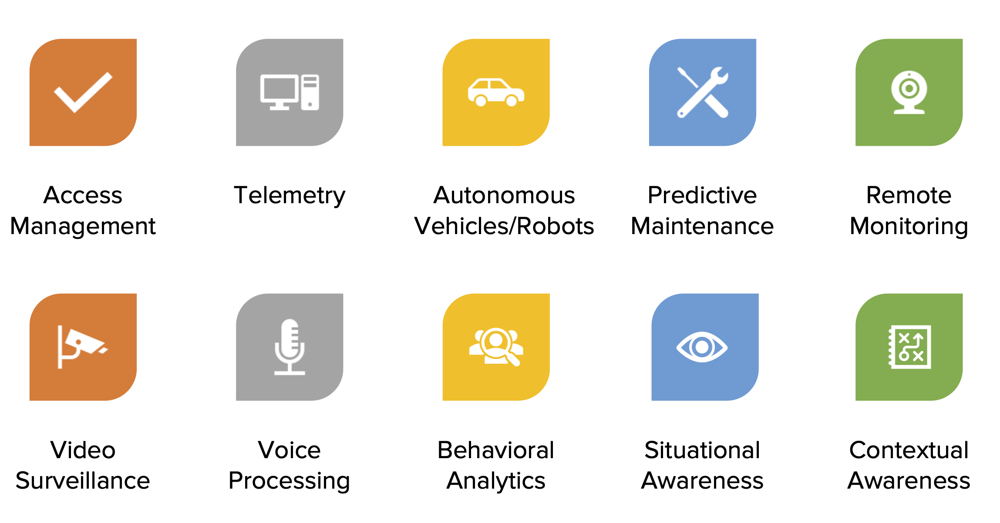

== Emerging Trends

This Clause addresses these topics:

** Edge Computing
** Heterogenous Computing
** Technology Forecasting

=== Edge Computing

The Internet of Things is anticipated to connect billions of devices to the internet. We are still in the early stage of IOT deployment, this according to Philippe Cases presentation at LP_DS.  IOT adoption was expected in 2016/2017. Data now suggest otherwise as many companies have yet to roll out their products. Perhaps what was missing was computing at the edge which now seems emergent.  During the Edge Computing World conference in December 2019,  https://aws.amazon.com/wavelength/[Amazon Wavelength] was announced as bringing AWS services to the edge of the 5G network.  Jay Theodore, Esri, anticipates several types of Edge Computing: Edge Servers, Edge Portals, Edge Devices.

Tradeoffs in distributed computing will be needed when considering computing at the edge and cloud computing. In Clause 3, we saw how data at the edge is big data with estimates, e.g., 4TB/day for each car.  When you're sending massive amount of data through the network, connectivity becomes an issue. Cloud computing is very effective for some applications. It's on demand elastic heterogeneous measured service. These have been very effective for geospatial computing at scale.  Now computing at the edge is becoming more powerful, for example, Nvidia is developing a processor which can be deployed to the edge and execute at 21 trillion operations per second.  But there's a real problem with cloud computing and that is latency. Communication even at the speed of light is too slow over distances for certain applications.   So there's a compromise as described by Marc Armstrong, of edge and fog computing to put processing in between IoT devices and the cloud in order to cut down on the amount of data that's transformed or transferred. Jay Theodore suggest that for batch inferencing you probably go to the cloud, and if you want to do interactive inferencing you peform that at the edges.  It turns out that geography really does matter when considering where to perform distributed computing.

.From Edge Sensors to Centralized Cloud

The Edge is also important because its location and presence over time.  The sensing and actuation associated with IoT devices at the edge can make use of the location.  The data obtained from sensing at the edge has a location content that may be useful immediately in edge computing and the the location can be attached to the data as it is distributed to the cloud and other devices.  Philippe Cases's surveys indicates that much of the sensing at the edge is video and that of all the data at the edge, 75% of the data is actually time series.

.Key use cases for processing at the edge

Marc Armstrong discussed data from the edge as "Fast Data."  Fast Data streams are driving computational complexity that needs to be addressed by experimental architectures and new analytic methods.  The roots of fast data come from research to temporal and dynamic GIS. (See Clause 6). We now have fast streaming data that is orders of magnitude faster. Experimental architectures to develop new methods are needed to do analysis of large and fast data and time frames.  Challenges of fast streaming data include, unknown sample size, non-stationarity, and algorithmic complexity in space and time.  Techniques such as reservoir sampling and approximate computing are suggested by Marc Armstrong for developing fast data analytics.

.IoT sensors Create Fast Data Streams

Coordinated observations is a powerful use case based on the emerging architecture of IoT sensing and actuation, Edge Computing, Fast Streaming Data, 5G communications and cloud computing.  Observations by an IoT sensor used to trigger subsequent computing, additional observations and subsequent actions all done in the distributed network without human observation.  This observation-processing-actuation workflow in the network suggests a powerful reusable pattern:

** Feature of interest detected in video in an initial location.
** Feature fits a decision rule that triggers subsequent observations or processing associated with the initial location or in other locations based on the trajectory of the feature of interest.
** Actuation of some IoT device that changes the processes associated with the detected feature of interest, again, either in the initial or other location.

This pattern can be extended based on the decision fusion pattern discussed in the OGC Fusion Study: useable templates of "If-This-Pattern-Consider-This-Decision."

This discussion on Edge Computing at LP_DS can be used to update the OGC Tech Trend on Edge Computing.

=== Heterogenous Computing

Marc Armstrong presented about the opportunities of Heterogenous Computing to geospatial data science.   https://queue.acm.org/detail.cfm?id=3038873[Heterogeneous computing] is a scheme in which the different computing nodes have different capabilities and/or different ways of executing instructions. In heterogeneous computing, the cores are different.   The figure shows a heterogeneous system with multi-core, GPU, FPGA, etc. We have seen use of GPUs earlier (Clause 6) for accelerating geospatial analytics.  Tensor Processing units are an another computing architecture that has value to geospatial.

.Generic Heterogeneous System

Some parts of geospatial problems are addressed with different computing architectures.  We can anticipate developing spatial middleware that would align the characteristics of geospatial algorithms to particular types of Hardware environments.  OGC is already working with the Khronos Group for geospatial computing based on GPUs.  Working with the http://www.hsafoundation.com/[Heterogeneous System Architecture (HSA) Foundation] in a similar fashion could bring additional improvements in geospatial data analytics.

Heterogenous Computing will be added to the OGC Technology Forecast based on the discussions at LP_DS.

=== Technology Forecasting

OGC conducts a forecasting activity for geospatial technology.  The forecasts provide early identification of disruptive technologies; supports discovery-driven planning; and drives OGC member decisions regarding geospatial innovations.  The figure shows the a summary of the process.

.OGC Technology Forecasting

The concept of the Location Powers: Data Science Summit and for some of the other Location Powers summits came from analysis in the OGC Technology Forecasting program.  The Forecast will be updated based on the results of LP_DS and a will drive discussion about the focus of future Location Powers events.

==== Recommendations

** Propose use cases for Edge Computing in the OGC Testbed planning.
** Discuss applications and computing methods for fast streaming data in OGC working groups
** Add Heterogeneous computing to the OGC Technology Forecast
** Consider heterogeneous computing as a topic for Future Directions Session.
** Review the work fo the HSA Foundation for possible discussion topics on geospatial computing.
** Develop concepts for future Location Powers: Summits based on Location Powers: Data Science results.
